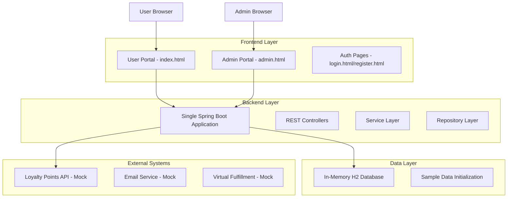

# Loyalty Redemption Portal - Technical Design Document

## Table of Contents
1. [System Architecture](#system-architecture)
2. [Backend Architecture](#backend-architecture)
3. [Frontend Architecture](#frontend-architecture)
4. [Database Design](#database-design)
5. [API Design](#api-design)
6. [Authentication System](#authentication-system)
7. [Workflow Engine](#workflow-engine)
8. [Code Structure Guide](#code-structure-guide)
9. [Implementation Details](#implementation-details)

## System Architecture

### High-Level Components



### Design Principles

1. **Simplicity**: Single-file backend for easy deployment
2. **Separation of Concerns**: Clear separation between user and admin interfaces
3. **Progressive Enhancement**: Works without JavaScript (forms still submit)
4. **Mobile-First**: Responsive design for all devices
5. **Security**: Role-based access with proper authentication

## Backend Architecture

### Single File Architecture Pattern

The entire backend is contained in `LoyaltyPortalApplication.java` with the following structure:

```java
@SpringBootApplication
public class LoyaltyPortalApplication {
    // 1. Main Application Class
    // 2. Configuration Beans (CORS, CommandLineRunner)
    // 3. Helper Methods (createProduct)
}

// 4. Entity Classes (8 total)
@Entity class Product { ... }
@Entity class Company { ... }
@Entity class User { ... }
@Entity class RedemptionOrder { ... }
@Entity class OrderApproval { ... }
// ... more entities

// 5. Repository Interfaces (8 total)
interface ProductRepository extends JpaRepository<Product, Long> { ... }
// ... more repositories

// 6. REST Controllers (6 total)
@RestController class ProductController { ... }
@RestController class AuthController { ... }
@RestController class AdminController { ... }
// ... more controllers

// 7. Service Classes (2 total)
@Service class AuthService { ... }
```

### Component Breakdown

#### 1. Application Configuration (Lines 25-121)
- **Purpose**: Bootstrap the application and initialize sample data
- **Key Methods**:
  - `corsConfigurer()`: Enables CORS for frontend integration
  - `init()`: CommandLineRunner that creates sample data on startup
  - `createProduct()`: Helper method for consistent product creation

#### 2. Entity Model (Lines 134-575)
- **Product Entity**: Core catalog item with type (PHYSICAL/VIRTUAL)
- **Company Entity**: B2B customer organization with loyalty account
- **User Entity**: Authentication with roles (ADMIN/USER)
- **RedemptionOrder Entity**: Complete order with workflow stages
- **OrderApproval Entity**: Audit trail for workflow approvals

#### 3. Repository Layer (Lines 318-575)
- **ProductRepository**: Basic CRUD + search functionality
- **UserRepository**: Authentication queries (findByEmail)
- **OrderRepository**: Workflow queries (findByWorkflowStage)
- **OrderApprovalRepository**: Approval history tracking

#### 4. Controller Layer (Lines 576-826)
- **ProductController**: Read-only product catalog API
- **AuthController**: User registration, login, profile
- **RedemptionController**: Order creation and balance checking
- **AdminController**: Order management and approval workflow
- **CompanyController**: Basic company information

#### 5. Service Layer (Lines 827-930)
- **AuthService**: User registration, password encryption, authentication

## Frontend Architecture

### Multi-Page Application Structure

#### 1. User Portal (`index.html`)
```javascript
// Global State Management
let products = [];      // Product catalog cache
let cart = [];         // Shopping cart items
let currentUser = null; // Authenticated user info

// Core Functions
loadProducts()     // Fetch and display product catalog
showCart()         // Shopping cart management
checkout()         // Order creation with validation
updateCartCount()  // UI state management
```

**Key Features**:
- Product browsing with responsive grid layout
- Shopping cart with quantity controls
- Checkout with balance validation
- User authentication integration

#### 2. Admin Portal (`admin.html`)
```javascript
// Global State Management
let orders = [];       // Order management cache
let products = [];     // Product administration
let stats = {};       // Dashboard statistics

// Core Functions
loadDashboard()    // Statistics and KPIs
loadOrders()       // Order management interface
approveOrder()     // Workflow progression
loadProducts()     // Product CRUD operations
```

**Key Features**:
- Dashboard with real-time statistics
- Order workflow management
- Product administration (CRUD)
- Multi-step approval interface

#### 3. Authentication System (`login.html`, `register.html`)
```javascript
// Authentication Functions
handleLogin()      // User authentication
handleRegister()   // User registration
showMessage()      // User feedback system
fillCredentials()  // Demo credential helper
```

**Key Features**:
- Form validation and error handling
- Role-based redirection
- Demo credentials for testing
- Registration with company selection

## Database Design

### Entity Relationship Diagram

```
┌─────────────┐    ┌─────────────┐    ┌─────────────┐
│    User     │    │   Company   │    │   Product   │
├─────────────┤    ├─────────────┤    ├─────────────┤
│ id (PK)     │    │ id (PK)     │    │ id (PK)     │
│ email       │ N  │ name        │ 1  │ name        │
│ password    │───▶│ loyalty_id  │◀──▶│ description │
│ first_name  │    │ tier        │    │ points_cost │
│ last_name   │    │ active      │    │ product_type│
│ role        │    └─────────────┘    │ category    │
│ company_id  │                       │ brand       │
└─────────────┘                       └─────────────┘
       │                                      │
       │ 1                                    │ N
       │                                      │
       ▼                                      ▼
┌─────────────┐    ┌─────────────┐    ┌─────────────┐
│OrderApproval│    │RedemptionOrder   │  OrderItem  │
├─────────────┤    ├─────────────┤    ├─────────────┤
│ id (PK)     │    │ id (PK)     │    │ id (PK)     │
│ order_id    │ N  │ order_number│ 1  │ order_id    │
│ approver_id │───▶│ status      │◀───│ product_id  │
│ level       │    │ workflow_stage   │ quantity    │
│ action      │    │ total_points│    │ points_each │
│ comments    │    │ company_id  │    └─────────────┘
└─────────────┘    └─────────────┘
```

### Key Design Decisions

1. **Single Table Inheritance**: All products in one table with `product_type` discriminator
2. **Workflow State Machine**: `status` and `workflow_stage` fields for order progression
3. **Audit Trail**: `OrderApproval` table tracks all workflow decisions
4. **Soft Deletes**: `active` flags instead of physical deletion
5. **Denormalization**: Points stored in orders for historical accuracy

## API Design

### RESTful Resource Design

#### Authentication Endpoints
```
POST /auth/login
Request: { "email": "user@acme.com", "password": "user123" }
Response: { "message": "Login successful", "user": {...} }

POST /auth/register  
Request: { "email": "...", "password": "...", "firstName": "...", ... }
Response: { "message": "User registered successfully", "user": {...} }
```

#### Product Catalog Endpoints
```
GET /products
Response: [{ "id": 1, "name": "MacBook Pro", "pointsCost": 85000, ... }]

GET /products/search?q=macbook
Response: [{ "id": 1, "name": "Apple MacBook Pro 16\"", ... }]
```

#### Order Management Endpoints
```
POST /redemption/orders
Request: { "companyId": 1, "items": [...], "totalPoints": 85000 }
Response: { "orderNumber": "ORD-1234567890", "status": "PENDING" }

POST /admin/orders/1/approve
Request: { "comments": "Approved by manager" }
Response: { "message": "Order approved at LEVEL_1", "nextStage": "LEVEL_2" }
```

### Error Handling Strategy

1. **Validation Errors**: 400 Bad Request with detailed field errors
2. **Authentication Errors**: 401 Unauthorized with clear message
3. **Authorization Errors**: 403 Forbidden with resource info
4. **Not Found Errors**: 404 Not Found with resource type
5. **Server Errors**: 500 Internal Server Error with correlation ID

## Authentication System

### Password Security
```java
private final BCryptPasswordEncoder passwordEncoder = new BCryptPasswordEncoder();

// Registration
user.setPassword(passwordEncoder.encode(plainPassword));

// Authentication
if (passwordEncoder.matches(plainPassword, user.getPassword())) {
    // Authentication successful
}
```

### Session Management
```javascript
// Frontend session storage
localStorage.setItem('user', JSON.stringify(userObject));

// Session validation
const user = JSON.parse(localStorage.getItem('user') || 'null');
if (!user) {
    window.location.href = 'login.html';
}
```

### Role-Based Access Control
```java
// Backend role checking (would be enhanced with Spring Security)
if (!"ADMIN".equals(user.getRole())) {
    return ResponseEntity.status(403).body("Access denied");
}
```

## Workflow Engine

### State Machine Design

```
Order States:
PENDING → APPROVED_LEVEL_1 → APPROVED_FINAL → SHIPPED/DELIVERED
   ↓              ↓               ↓
REJECTED    REJECTED       REJECTED

Workflow Stages:
LEVEL_1 → LEVEL_2 → COMPLETED
```

### Implementation Details

```java
// Workflow progression logic
if ("LEVEL_1".equals(currentStage)) {
    order.setStatus("APPROVED_LEVEL_1");
    order.setWorkflowStage("LEVEL_2");
    order.setLevel1ApprovedAt(LocalDateTime.now());
} else if ("LEVEL_2".equals(currentStage)) {
    order.setStatus("APPROVED_FINAL");
    order.setWorkflowStage("COMPLETED");
    processApprovedOrder(order); // Auto-process virtual orders
}
```

### Approval Audit Trail
```java
// Create audit record for each approval
OrderApproval approval = new OrderApproval();
approval.setOrder(order);
approval.setApprover(user);
approval.setApprovalLevel(level);
approval.setAction("APPROVED");
approval.setComments(comments);
approval.setActionAt(LocalDateTime.now());
```

## Code Structure Guide

### For New Developers

#### Adding New Entities
1. Create entity class after line 316 (before repositories)
2. Add JPA annotations: `@Entity`, `@Table`, `@Id`, `@GeneratedValue`
3. Include getters/setters and relationships
4. Create repository interface extending `JpaRepository`

#### Adding New API Endpoints
1. Create new `@RestController` after line 826
2. Use `@RequestMapping("/api-path")` for base path
3. Add methods with `@GetMapping`, `@PostMapping`, etc.
4. Follow existing error handling patterns

#### Modifying Frontend
1. **User Portal**: Edit `index.html` for customer-facing features
2. **Admin Portal**: Edit `admin.html` for management features
3. **Authentication**: Edit `login.html`/`register.html` for auth changes
4. Follow existing JavaScript patterns and CSS classes

### Testing Strategy

#### Backend Testing
```bash
# Run the application
mvn spring-boot:run

# Test endpoints with curl
curl http://localhost:8080/products
curl -X POST http://localhost:8080/auth/login \
  -H "Content-Type: application/json" \
  -d '{"email":"user@acme.com","password":"user123"}'
```

#### Frontend Testing
```bash
# Start frontend server
python3 -m http.server 3000

# Navigate to pages
http://localhost:3000/login.html
http://localhost:3000/index.html (after login)
http://localhost:3000/admin.html (admin login)
```

## Implementation Details

### Sample Data Creation
The system automatically creates sample data on startup:
- **Companies**: ACME Corporation with loyalty account
- **Users**: Admin (admin@acme.com) and User (user@acme.com) accounts
- **Products**: 10 products with Unsplash images across multiple categories

### Key Design Patterns

1. **Repository Pattern**: Data access abstraction with JPA
2. **Controller-Service Pattern**: Separation of web and business logic
3. **DTO Pattern**: Data transfer between layers (implicit with entities)
4. **Factory Pattern**: Consistent product creation with helper methods
5. **State Machine**: Order workflow with clear state transitions

### Performance Considerations

1. **Database**: H2 in-memory for development (should be PostgreSQL in production)
2. **Caching**: No caching implemented (Redis recommended for production)
3. **Pagination**: Not implemented for large datasets
4. **Connection Pooling**: Default Spring Boot configuration

### Security Considerations

1. **Password Encryption**: BCrypt with default strength
2. **CORS**: Configured for localhost development
3. **Input Validation**: Basic validation with JPA constraints
4. **Session Security**: Client-side localStorage (should be server-side JWT)

## Deployment Architecture

### Development Environment
```
Developer Machine:
├── Backend: mvn spring-boot:run (Port 8080)
├── Frontend: python3 -m http.server 3000
└── Database: H2 in-memory (automatic)
```

### Production Recommendations
```
Production Environment:
├── Backend: Docker container with Spring Boot
├── Frontend: Nginx serving static files
├── Database: PostgreSQL with connection pooling
├── Caching: Redis for session storage
└── Load Balancer: Multiple backend instances
```

This design document provides a complete technical blueprint for understanding, modifying, and extending the Loyalty Redemption Portal system. Each component is designed for simplicity while maintaining enterprise-grade functionality.